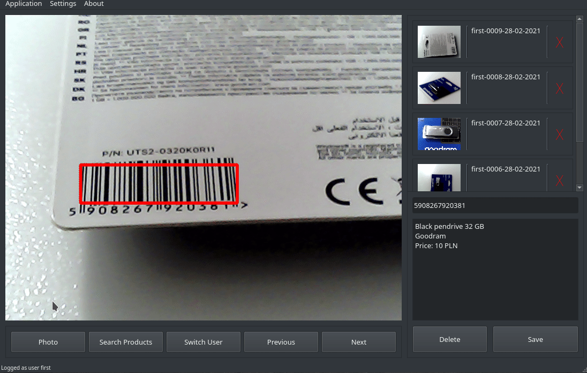
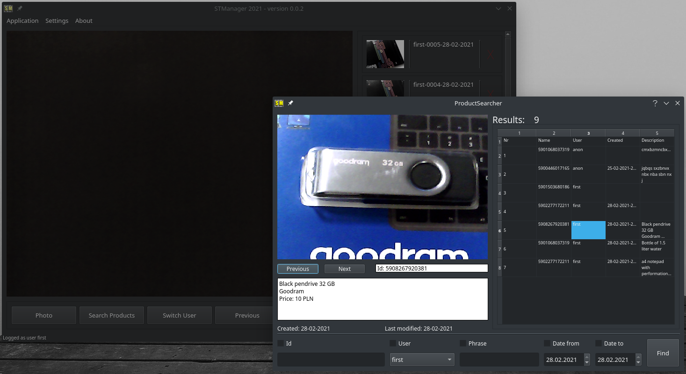

# __STManager__
### 
---

* __Do you lose revenue from false customer complains?__
* __Do you need a small program to manage information about your products?__
* __Do you want need small and easy program to organise product data for a stocktake?__

#### If answered YES to any of the above question then you have just found a perfect app!

### Short description
__STManager__ takes photos of your products, correlates them with their product barcode
and then lets you go through them.

App manages to detect barcodes from camera or from hand scanner(_when scanner mode selected_).
You can then search through the products and chose many of the available filters to find the
exact item you are looking for.

<br/>

### Demo:


_Usual look of the app._

<br/>


_Detecting barcode from live webcam video input. Works really nicely with bad light, camera or_
_dirty product package._

<br/>



_After clicking the **Search Product** button the searcher window will appear! You can find there the_
_product you are looking for._

<br/>

---

### Download prebuild version:
* [Windows](https://sourceforge.net/projects/stmanager-python/files/windows/)
* [Linux](https://sourceforge.net/projects/stmanager-python/files/linux/)
* ~Mac~

<br/>

### Technologies:

* __python 3.9__ - used annotation available in only python version 3.8+
* __PyQt5__  - interface
* __opencv__ - middleman beetween qt5 and pyzbar
* __pyzbar__ - barcode detection

<br/>

### Other python tools used:
* __flake8__ - linting
* __black__  - small reformatting improvments
* __pipenv__ - managing packages

<br/>

### Install:
Instructions and binary installers available on sourceforge version of the app. Choose one
of the available links.

### Build:
__Run application from source__
```bash
git clone https://github.com/michalwilk123/STManager.git
make install
make
```

__Create an executable for the app__
```bash
git clone https://github.com/michalwilk123/STManager.git
make install
make build
```
