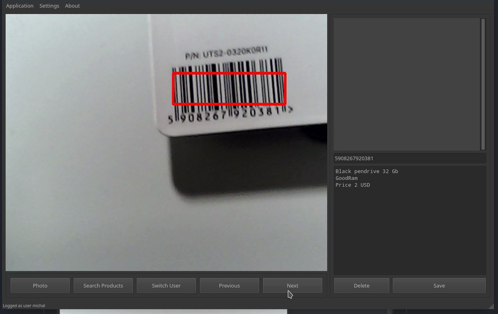
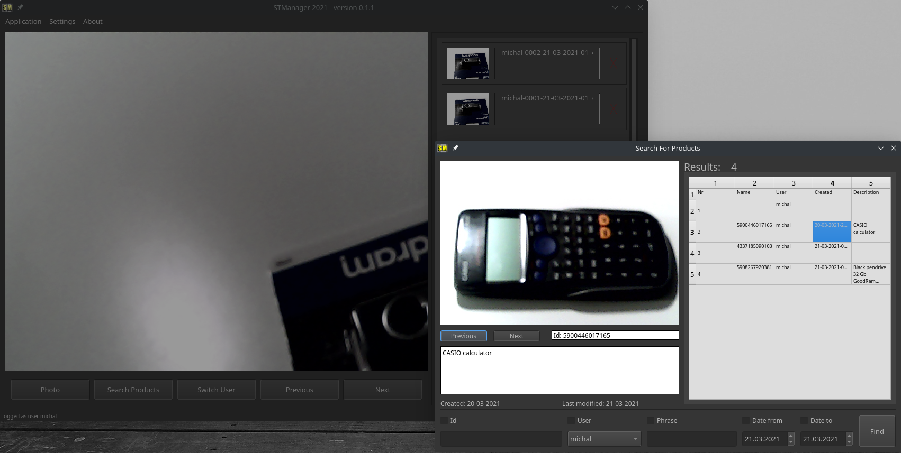

[](https://www.codefactor.io/repository/github/michalwilk123/stmanager)
# __STManager__
### 
---

* __Do you lose revenue from false customer complains?__
* __Do you need a small program to manage information about your products?__
* __Do you want need an easy program to organise product data for a stocktake?__

#### If answered YES to any of the above question then you have just found a perfect app!

### Short description
__STManager__ takes photos of your products, correlates them with their product barcode
and then lets you go through them.

App manages to detect barcodes from camera or from hand scanner(_when scanner mode selected_).
You can then search through the products and chose many of the available filters to find the
exact item you are looking for.

<br/>

### Demo:


_Usual look of the app. The theme of the app is independent from the platform_

<br/>


_Detecting barcode from live webcam video input. Works really well with bad lighting, camera or_
_dirty product barcodes._

<br/>



_After clicking the **Search Product** button the searcher window will appear! You can find there the_
_product you are looking for._

<br/>

---

<br/>

### Technologies:

* __python 3.9__ - used annotation available in only python version 3.8+
* __PyQt5__  - interface
* __opencv__ - middleman beetween qt5 and pyzbar
* __pyzbar__ - barcode detection

<br/>

### Other python tools used:
* __flake8__ - linting
* __black__  - small reformatting improvements
* __pipenv__ - managing packages

<br/>

### Install:
Instructions and binary installers available on the sourceforge page. Choose one
of the available links.

* [Windows](https://sourceforge.net/projects/stmanager-python/files/windows/)
* [Linux](https://sourceforge.net/projects/stmanager-python/files/linux/)

__Windows 10:__
1) Download installer from link _1)_
2) Follow instructions from the installer

__Debian based systems like Ubuntu or Linux Mint:__
1) Download .deb package from link _2)_
2) In the folder containing downloaded file execute below command:

```bash
sudo apt-get install STManager.deb
```

__Arch based systems like Manjaro, Arch:__

1) Download STManager.pkg.tar.xz file from link _2)_
2) In the folder containing downloaded file execute below command:
```bash
sudo pacman -U install STManager.pkg.tar.xz
```

__Every installer is bundled with a corresponding uninstaller!__

### Build from source:

__Clone this repository:__
```bash
git clone https://github.com/michalwilk123/STManager.git
```

__Options:__
__Run application (python version) from source:__
```bash
git clone https://github.com/michalwilk123/STManager.git
make install_packages
make
```

__Create a binary executable for the app:__
```bash
git clone https://github.com/michalwilk123/STManager.git
make install_local
```

__Create an installer for the app:__
_Installer version depends on user platform. In other words:_
_you cannot create installer for linux distro from windows_
```bash
git clone https://github.com/michalwilk123/STManager.git
make installer
```
